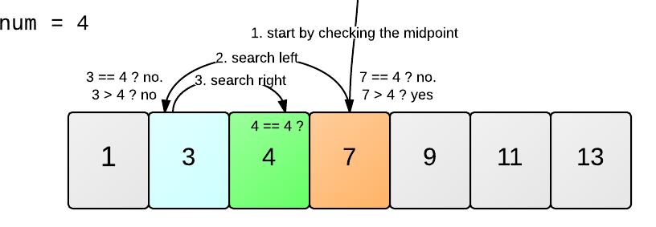

## Binary Search (Бинарный поиск)
**Идея:** Делим отсортированный массив пополам и каждый раз отбрасываем ненужную половину.


- **Когда использовать:**
  - Когда массив/список **отсортирован**.
  - Нужно быстро найти элемент или проверить его наличие.
  - Примеры: поиск слова в словаре, поиск числа в отсортированном списке, задачи типа *«найди минимальное значение X, которое удовлетворяет условию»*.

- **Сложность:**
  - Время: **O(log n)**
  - Память: **O(1)** (итеративно) или **O(log n)** (рекурсивно).

- **Проблемы, которые решает:**
  - Поиск позиции элемента в массиве.
  - Оптимизационные задачи на *монотонные функции*.

## Код
```python
def binary_search(arr, target):
    left, right = 0, len(arr) - 1
    while left <= right:
        mid = (left + right) // 2
        if arr[mid] == target:
            return mid
        elif arr[mid] < target:
            left = mid + 1
        else:
            right = mid - 1
    return -1
